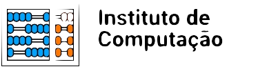

#+Title: My org-mode specification
#+Subtitle: Also some testing ground
#+language: pt
#+date: nil

As proven in [[id:3c0c777a-86e8-4c13-8989-fa1f723018dd::thm-important][the important theorem]]...
I can also link using [[file:doe26.org::thm-important]] or to [[file:Doe26.org::theo:important]].
Can org-ref help me here?

The thing is:
- can org-transclude transclude this theorem?
- can vulpea/org-node/org-roam interpret this theorem as a connection?
- can I have some king of completion into adding this link?

* Pré-requisitos
:PROPERTIES:
:ID:       b686ad7f-05a6-41e7-9bb0-19e9850c10f5
:END:

Preciso de alguma forma de inserir links sem muito atrito.
Me incomoda que, com ferramentas como ~org-roam~, eu preciso inserir o link e eu não consigo alterar a descrição do link facilmente.

** Backlinks
Preciso conseguir facilmente navegar entre aqueles nós que referenciam o nó atual.

** Todo's e anotações

Eu gosto dos comentários de org-mode, mas será que eles conseguem ser exportados? Gostaria que coisas como:

# TODO fazer alguma coisa

Fossem realmente exportados para um "todo inline".

Existe também a questão de anotações e todo's no meio do parágrafo.
Neste caso, creio que algo como um link todo:resolver ou [[note:aqui poderia ser melhor]].
~org-special-block-extras~ deve ser uma boa forma de resolver isso.

Lista de checkboxs:
- [ ] Em aberto
- [-] Parcialmente
- [X] Concluído
  
*** TODO A ser feito
*** DONE Concluído

* Blocos

** Images
#+name: fig:example
#+caption: Uma imagem de exemplo.
#+attr_latex: :align center

Eu não sei se prefiro a sintaxe de ~#+name:~ ou o <<fig:2>>.

<<fig:2>>
#+caption: Uma imagem de exemplo.
#+attr_typst: :align center

** Tables
#+name: My Target
| a  | table      |
|----+------------|
| of | four cells |
|    |            |

** Teoremas

Teoremas e outros blocos matemáticos precisam seguir uma sintaxe similar.

#+begin_theo Teorema Fundamental da Álgebra :label theo:fund
Blah blah blah.
#+end_theo

ou talvez com o <<theo:fund>> fora:

<<theo:fund>>
#+begin_theo Teorema Fundamental da Álgebra
Blah blah blah.
#+end_theo

** Código

<<algo:py:1>>
#+begin_src python
print(3 + 2)
#+end_src

#+RESULTS:

Para fazer com que os resultados também sejam exportados, eu preciso corrigir o fato do babel não utilizar o ~uv~ para rodar as coisas.

** Notas de rodapé

O ~org-mode~ possui um suporte interessante para as notas de rodapé.[fn:1]

* Listas

1. Milk
2. Eggs
   - Organic
3. Cheese
   + Parmesan
   + Mozarella

Listas de definições:
- termo :: definições
  - aaa :: bbb
  - mudando de tipo de lista 
    + aaa
    + ddd
- mais termo :: mais definições

* Footnotes

[fn:1] Por exemplo, algo como estas notas! 
